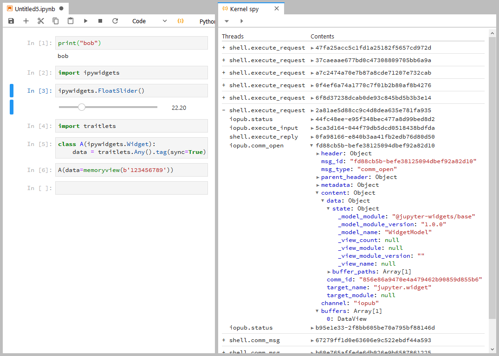

# jupyterlab-kernelspy

An extension for inspecting messages to/from a kernel in Jupyter Lab.



## Prerequisites

* JupyterLab

## Installation

```bash
jupyter labextension install jupyterlab-kernelspy
```

## Development

For a development install (requires npm version 4 or later), do the following in the repository directory:

```bash
npm install
npm run build
jupyter labextension link .
```

To rebuild the package and the JupyterLab app:

```bash
npm run build
jupyter lab build
```
